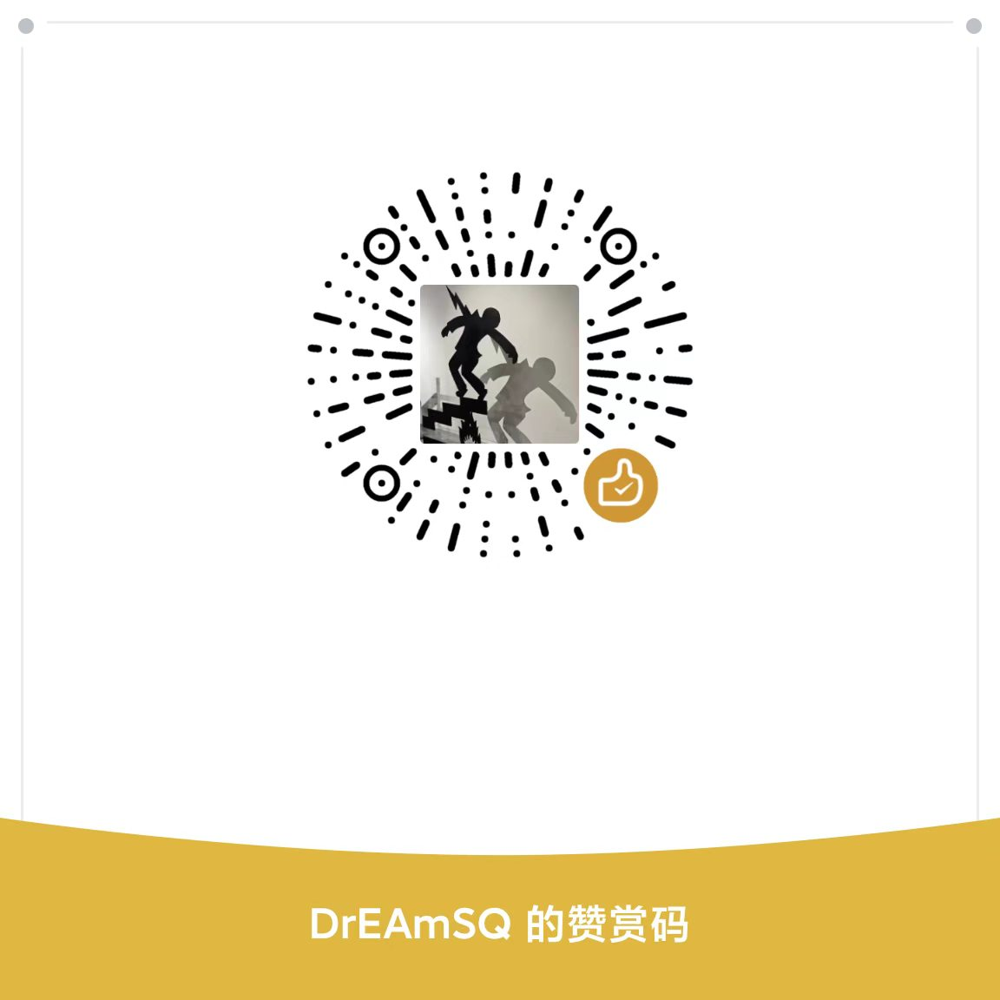

# CS2 Insight Agent

[License](LICENSE)
[Version](https://github.com/DrEAmSs59/CS2-insight-agent/releases)
[Player Guide](PLAYER_GUIDE.md)

**CS2 洞察智能体** — 专为 CS2 玩家打造的桌面端智能电竞终端。

自动解析 Demo 录像，提取**高光 / 下饭 / 梗死亡**时刻，可调用 LLM 生成毒舌锐评与评分，并通过 OBS 全自动控制 CS2 回放录制成片，开箱即用。

---

## Tech Stack


| Layer    | Technology                                      |
| -------- | ----------------------------------------------- |
| Frontend | React 19 + TailwindCSS 4 + Vite 6 + Zustand     |
| Backend  | Python 3.10 + FastAPI                           |
| 解析引擎     | demoparser2 + pandas                            |
| AI 网关    | OpenAI 兼容 SDK（DeepSeek / Qwen / GLM / OpenAI 等） |
| OBS 控制   | obs-websocket-py                                |
| Demo 库   | aiosqlite + watchdog（目录监听）                      |
| CS2 集成   | Game State Integration（启动就绪门控）                  |


---

## Project Structure

```
CS2-insight-agent/
├── backend/
│   └── app/
│       ├── main.py               # FastAPI 入口与 API 路由
│       ├── demo_parser.py        # 高光 / 下饭 / 梗死亡 / 合集判定引擎
│       ├── demo_parse_isolation.py  # 子进程隔离解析（防 Rust panic 拖垮主进程）
│       ├── ai_reviewer.py        # 毒舌 AI 锐评（OpenAI 兼容）
│       ├── insight_agent.py      # AI 模式主调度
│       ├── obs_director.py       # OBS 自动导播 / CS2 回放控制
│       ├── win_cs2_console.py    # Windows CS2 控制台注入（SendInput / WM_CHAR）
│       ├── gsi_ready.py          # GSI 接收端，作为录制就绪门控
│       ├── demo_db.py            # 本地 Demo 库（SQLite）
│       ├── demo_watcher.py       # 录像目录监听（watchdog）
│       ├── demo_library_hub.py   # 库内事件 SSE 推送
│       └── env_utils.py          # 配置管理 & CS2 路径探测
├── frontend/
│   └── src/
│       ├── App.jsx               # 主应用
│       ├── components/
│       │   ├── Sidebar.jsx              # 侧边栏（OBS / CS2 / 关注玩家 / LLM 配置）
│       │   ├── DemoUpload.jsx           # 拖拽上传
│       │   ├── PlayerSelect.jsx         # 玩家选择 + 战绩面板
│       │   ├── MatchScoreboard.jsx      # 计分板
│       │   ├── ClipList.jsx             # 片段列表
│       │   ├── ClipCard.jsx             # 单条片段卡
│       │   ├── MemeDeathMontageCard.jsx # 「研发全集」整局梗合集卡
│       │   ├── RecordWarmupModal.jsx    # 录制前观战预热选项
│       │   ├── RecordingQueueDrawer.jsx # 录制队列抽屉（批量管理）
│       │   ├── MatchSwitcher.jsx        # 多场次切换
│       │   ├── LibraryLoadModeModal.jsx # 库装载模式
│       │   ├── ProgressBar.jsx
│       │   └── ActionBar.jsx
│       └── stores/recordingQueueStore.js  # Zustand 录制队列
└── README.md
```

---

## Quick Start

### 1. Backend

```bash
cd backend
pip install -r requirements.txt
uvicorn app.main:app --reload --port 8000
```

### 2. Frontend

```bash
cd frontend
npm install
npm run dev
```

前端跑在 `http://localhost:5173`，Vite 已配置代理把 `/api/*` 转发到后端 `http://localhost:8000`。

---

## Features

### 🎯 解析与片段挖掘

- **多场次 Demo 解析** — 支持单文件、多文件、目录监听三种入口；同一玩家在多场 Demo 中的高光会按场次组织展示。
- **目标玩家锁定** — 自动从 Demo 解析出 roster，可按 Steam ID / `user_id` / 昵称三档兜底定位，兼容 5E、完美世界、官匹的不同导出习惯。
- **关注玩家名单** — 在侧栏维护一份关注昵称，新增 Demo 入库时**自动**写好库展示名（A K/D · B K/D 多人并排），不耗深度解析资源。
- **子进程隔离解析** — Demo 解析放到独立进程，遇到 `demoparser2` 的 Rust panic 也不会拖垮 FastAPI 主进程。

### 🎬 片段类型（自动分类）

- **高光 (highlight)**
  - 单回合 ≥ 3 杀
  - 颗秒 / 跳杀 / 反杀 / Clutch / 1vN / 刀杀等带情景标签
- **下饭 (fail)**
  - 被电击枪击杀 / 被沙鹰爆头 / 被队友击杀
  - 三轨数据源驱动的「人肉吸铁石」「人体描边」「亲儿子喂饭」高级下饭场景
- **梗死亡 (meme_death)**
  - 全程 0/1/2 杀且高死亡的「研发」局：211 高材生、o 系列、i18 典中典、z 系列坐牢
  - 整局加一张「研发全集」大卡，可配 AI 总括点评
- **跨回合合集 (compilation)**
  - 🥩 亲儿子喂饭：本场对某敌人单方面输出
  - ☠️ 本命苦主：本场被某攻击者反复处刑
  - 🎬 全部击杀 / 💀 全部死亡：本场目标玩家所有击杀 / 死亡的串烧

### 🤖 AI 锐评（可选）

- **OpenAI 兼容多家厂商** — 内置 DeepSeek、通义 Qwen、智谱 GLM、MiniMax、OpenAI、OpenRouter；本地模型支持 Ollama、LM Studio。
- **毒舌人设 Prompt** — 高光吹爆、下饭嘲讽、梗死亡当段子；硬约束 100 字以内、单行 JSON 输出，不输出场外废话。
- **整局梗合集总评** — 211/o/i/z 系研发局会触发「整局综合评价」，独立于片段级评分。

### 📺 OBS 自动导播

- **GSI 启动就绪门控** — 用 CS2 Game State Integration 等真正进入游戏画面再注入控制台命令，超时（默认 120s）会**前端弹窗中止**，避免在读条页瞎打命令。
- **智能跳跃剪辑 (smart jump-cut)** — 多杀片段按击杀 tick 自动分段，段间用 OBS `PauseRecord` / `ResumeRecord` 拼接，输出无空镜的紧凑成片。
- **POV 段** — 高光自动追加受害者视角、失误自动追加击杀者视角，叙事弧线完整。
- **录制前观战预热** — 一键勾选 `cl_draw_only_deathnotices` / `hud_showtargetid 0` / `tv_nochat 1` / 隐藏投掷物轨迹 / 自定义 FOV 等观战 cvar，首片段统一注入。
- **批量队列录制** — 跨场次 / 跨玩家加入队列，一次启动 CS2 顺序录完所有片段，并自动按 `玩家_地图_回合_击杀数` 命名 OBS 输出文件。
- **键位与配置保护** — 录制开始注入 `unbindall` + 默认绑定，避免玩家自定义键位干扰；同时把玩家 `config.cfg` / `video.txt` / `user_convars_*.vcfg` 的当前快照拷贝到项目目录 `.cs2_config_backup/` 留档，运行期内存快照在 `taskkill` CS2 后自动回滚 archive cvar。
- **CS2 占用检测** — 启动录制前若发现 CS2 已在运行，前端弹同款阻断对话框提示用户先关闭。

### 📚 Demo 库

- **SQLite 本地库** — 解析过的 Demo 写入 `cs2-insight.db`，跨次会话保留地图、记分板、关注玩家展示名等元数据。
- **目录实时监听** — 在侧栏添加 5E / 完美 / 官匹 demo 目录，新增文件自动入库 + 轻量元数据解析。
- **SSE 实时推送** — 库内新增 / 改名 / 解析状态变化时通过 `/api/demos/stream` 推送，前端无需轮询。

### 🎨 UI / UX

- 暗黑磨砂黑底 + CS2 经典亮橙强调色，原生电竞风。
- 录制队列抽屉支持跨场次跨玩家管理与节奏微调（pre-roll / post-kill / jump-cut gap 等参数 per-clip 可覆盖）。
- 阻断弹窗根据后端返回 detail 自动判断「CS2 占用 / GSI 未就绪 / 录制任务进行中」并切换副标题。

---

## API Endpoints（节选）


| Method | Path                        | Description          |
| ------ | --------------------------- | -------------------- |
| GET    | `/api/health`               | 健康检查                 |
| GET    | `/api/config`               | 获取配置                 |
| PUT    | `/api/config`               | 更新配置                 |
| POST   | `/api/config/detect-cs2`    | 自动探测 cs2.exe 路径      |
| POST   | `/api/obs/test`             | 测试 OBS WebSocket 连接  |
| POST   | `/api/demo/upload`          | 单文件上传                |
| POST   | `/api/demo/upload-multiple` | 多文件上传                |
| POST   | `/api/demo/parse`           | 单玩家解析                |
| POST   | `/api/demo/parse-multi`     | 同 Demo 多玩家解析         |
| POST   | `/api/demo/parse-batch`     | 跨 Demo 批量解析          |
| GET    | `/api/demos`                | Demo 库列表（分页）         |
| GET    | `/api/demos/stream`         | 库变更 SSE 流            |
| POST   | `/api/demos/scan`           | 手动扫描监听目录             |
| POST   | `/api/demos/{id}/parse`     | 重新解析                 |
| POST   | `/api/demos/{id}/analyze`   | 直接对库内 Demo 出片段       |
| GET    | `/api/demos/{id}/players`   | 库内 Demo 玩家名册         |
| POST   | `/api/record/start`         | 启动单 Demo 录制          |
| POST   | `/api/record/batch`         | 启动跨 Demo / 跨玩家批量录制   |
| POST   | `/api/record/abort`         | 中止当前录制               |
| POST   | `/api/gsi/cs2`              | CS2 GSI Sink（录制就绪门控） |
| GET    | `/api/gsi/status`           | 查看最近 GSI 状态          |


---

## Roadmap

- **V1.x.x** — 高光引擎 + AI 锐评 + OBS 全自动导播 ✅ *Current*
- **V2.x.x** — 编辑切片合成视频，开场动画，BGM，AI Agent 一句话自动录制视频，外网数据挂载（5E / 完美世界），作为 AI 上下文增强点评深度
- **V3.x.x** — 战术教练（投掷物轨迹分析 / 首杀热力图 / 路线复盘）

---

## License & Disclaimer

本项目采用 [PolyForm Noncommercial 1.0.0](https://polyformproject.org/licenses/noncommercial/1.0.0/) 协议发布。

- ✅ 允许个人学习、研究、爱好、评测及其他非商业用途使用。在遵守本协议的前提下，你可以阅读、修改、构建和分发本项目源码及其衍生版本。
- ⛔ 未经书面授权，禁止将本项目或其衍生版本用于任何商业用途，包括但不限于：商业软件、付费服务、商业代剪/代录服务、商业平台集成、对外销售、出租、转售或作为商业产品的一部分分发。
  - 商业授权咨询：`dreamss29_@outlook.com`
- 📦 如果你分发本项目的编译产物、安装包或修改版本，请同时保留本项目的许可证声明，并遵守 `THIRD_PARTY_LICENSES.md` 中列出的所有第三方开源组件许可证。

## 商标声明

Counter-Strike 2、CS2、Counter-Strike、Steam、Valve 等名称、商标和标识归其各自权利人所有。

本项目与 Valve Corporation、完美世界竞技平台、5E 对战平台、OBS Studio 及其他相关平台或软件的所有者不存在从属、合作、赞助、授权或背书关系。

### 安全使用提示

- **默认录制流程**调用 CS2 时使用 `-insecure` 仅用于本地 Demo 回放，不存在 DLL 注入或 Hook；不会对磁盘上的 `.dem` 做修改，不连接、不修改、不干预任何官方游戏服务器、匹配服务或反作弊系统，也不提供任何作弊、绕过检测或破坏公平竞技的功能，**不要在已登录匹配服务器的 CS2 客户端中并行使用**，以免触发反作弊系统的不必要警示。
- 若你在「常用参数管理 → 实验性功能」中**主动开启 POV**，程序会临时向 CS2 的 `game/csgo` 目录写入 `pov.vpk`，并**增量修改** `gameinfo.gi` 的 `SearchPaths` 以加载 POV HUD 资源；录制结束或异常收尾时会自动恢复。该模式同样**强制**使用 `-insecure` 启动 CS2，**不要用于连接 VAC 安全服务器**。
- 录制期间会临时修改若干 CS2 archive cvar 与按键绑定。本项目会在启动录制时在仓库根目录的 `.cs2_config_backup`中**自动备份**玩家原始的 `config.cfg` / `video.txt` / `user_convars_*.vcfg`，录制结束后会回滚；如遇异常退出或未知错误导致的设置被覆盖，可在该目录手动取回原始文件。

## 支持项目

如果这个项目帮你节省了剪辑时间，欢迎请我喝一杯咖啡 ☕  
你的支持会用于 Demo 解析、录制兼容性测试和后续功能维护。

